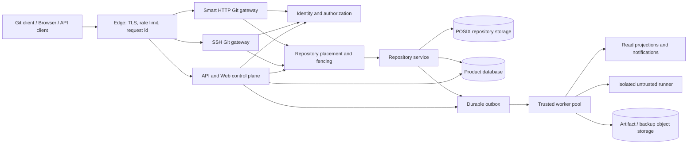
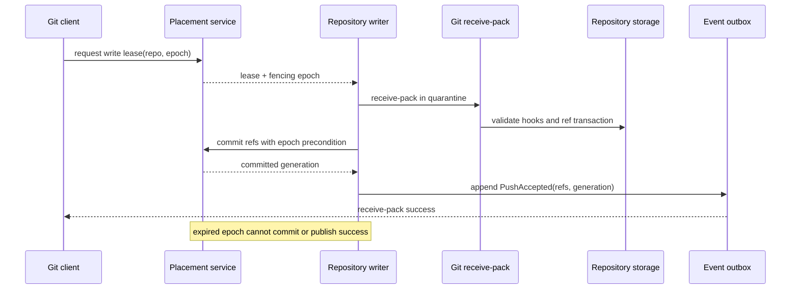
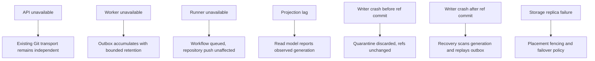

# AsterGit 平台架构图

## 逻辑平面

```mermaid
flowchart LR
    C[Git client / Browser / API client]
    E[Edge: TLS, rate limit, request id]
    API[API and Web control plane]
    SSH[SSH Git gateway]
    HTTP[Smart HTTP Git gateway]
    AUTH[Identity and authorization]
    PLACE[Repository placement and fencing]
    REPO[Repository service]
    FS[(POSIX repository storage)]
    DB[(Product database)]
    OUT[Durable outbox]
    W[Trusted worker pool]
    R[Isolated untrusted runner]
    ART[(Artifact / backup object storage)]
    PROJ[Read projections and notifications]

    C --> E
    E --> API
    E --> SSH
    E --> HTTP
    API --> AUTH
    SSH --> AUTH
    HTTP --> AUTH
    API --> PLACE
    SSH --> PLACE
    HTTP --> PLACE
    PLACE --> REPO
    REPO --> FS
    API --> DB
    REPO --> DB
    API --> OUT
    REPO --> OUT
    OUT --> W
    W --> PROJ
    W --> R
    W --> ART
```

## Repository write fencing

```mermaid
sequenceDiagram
    participant G as Git client
    participant P as Placement service
    participant W1 as Repository writer
    participant R as Git receive-pack
    participant F as Repository storage
    participant O as Event outbox

    G->>P: request write lease(repo, epoch)
    P-->>W1: lease + fencing epoch
    W1->>R: receive-pack in quarantine
    R->>F: validate hooks and ref transaction
    W1->>P: commit refs with epoch precondition
    P-->>W1: committed generation
    W1->>O: append PushAccepted(refs, generation)
    O-->>G: receive-pack success
    Note over P,W1: expired epoch cannot commit or publish success
```

## Failure boundaries

```mermaid
flowchart TD
    A[API unavailable] --> B[Existing Git transport remains independent]
    C[Worker unavailable] --> D[Outbox accumulates with bounded retention]
    E[Runner unavailable] --> F[Workflow queued, repository push unaffected]
    G[Projection lag] --> H[Read model reports observed generation]
    I[Writer crash before ref commit] --> J[Quarantine discarded, refs unchanged]
    K[Writer crash after ref commit] --> L[Recovery scans generation and replays outbox]
    M[Storage replica failure] --> N[Placement fencing and failover policy]
```
